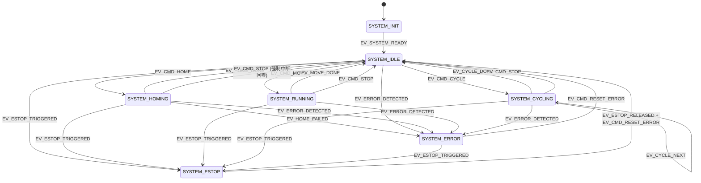

# 工业定长送料与定位执行单元 — 架构设计文档

> 作者：Architect 模式
> 日期：2026-05-10
> 状态：等待用户确认

---

## 第 1 部分：理解确认

1. **主控的核心职责是"中间人"**：STM32G474VET6 不直接做位置/速度/力矩闭环控制，而是作为上位机（USART1）与电机（FDCAN1）之间的桥梁，负责指令转发、状态收集、逻辑编排和异常判断。

2. **电机已内置几乎所有底层功能**：ZDT_X57S 的 X 固件自带梯形加减速位置模式、回零（含碰撞检测）、力矩/速度/位置三环控制、过流/过热/堵转保护、定时返回系统参数等。主控**不需要**重写 PID、不需要做轨迹规划、不需要做电流采样。

3. **项目的真正难点在于数据流编排和状态机设计**：FDCAN 中断收电机返回数据、USART DMA 收上位机指令、TIM6 周期性巡检、PD15 急停，四股异步事件必须协调。电机同时有"命令应答"和"定时主动上报"两类数据——主控需要既能及时响应又能批量转发。

4. **硬约束（✅）**：STM32G474VET6、ZDT_X57S + X 固件、FDCAN1 经典CAN 500Kbps（PA11/PA12）、USART1 115200 + DMA（PA9/PA10）、TIM6 @1kHz（Prescaler=170-1, Period=999）、PD15 下降沿急停、CMake 构建、电机地址=1、校验码=0x6B、X_V2 驱动库已可用。**上位机通信协议未定**，主控侧可先做简单实现。

5. **自主决策空间（💡）**：文件组织结构、状态机状态数量和转换规则、上位机协议初版格式、X_V2 二次封装粒度、TIM6 用途分配、CAN 中断处理策略、回零流程是否两段式、是否使用定时返回功能——这些都由我自行判断。

---

## 第 2 部分：架构决策

### 2.1 文件夹与文件组织方案

在现有 `App/` / `Core/` / `Drivers/` 基础上扩展，**不新建顶层目录**，保持结构扁平：

```
M_Project/
├── CMakeLists.txt                          # [修改] 新增用户源文件和 include 路径
├── App/
│   ├── Inc/
│   │   ├── X_V2.h                          # [保留] 电机驱动库头文件（不改动）
│   │   ├── state_machine.h                 # [新建] 状态机：状态枚举、事件枚举、全局状态变量、转换函数声明
│   │   ├── protocol.h                      # [新建] 上位机协议：帧格式宏、命令码枚举、打包/解包函数声明
│   │   ├── motion.h                        # [新建] 工艺动作层：回零、定长送料、点位定位、循环运行 函数声明
│   │   └── safety.h                        # [新建] 安全监测层：电机状态检查、急停处理、错误码定义
│   └── Src/
│       ├── X_V2.c                          # [保留] 电机驱动库实现（不改动）
│       ├── state_machine.c                 # [新建] 状态机实现：状态转换表、事件处理、主循环调度入口
│       ├── protocol.c                      # [新建] 上位机协议实现：帧解析、命令分发、响应打包、数据转发
│       ├── motion.c                        # [新建] 工艺动作实现：调用 X_V2 完成具体动作序列
│       └── safety.c                        # [新建] 安全监测实现：周期性标志位检查、急停回调、错误记录
├── Core/
│   ├── Inc/                                # [不改动] CubeMX 生成的头文件
│   ├── Src/
│   │   ├── main.c                          # [修改] 初始化后进入状态机主循环，替代现有测试代码
│   │   ├── stm32g4xx_it.c                  # [修改] 在 FDCAN/USART/EXTI/TIM6 中断回调中添加用户逻辑
│   │   ├── fdcan.c                         # [不改动] can_SendCmd 已实现
│   │   ├── usart.c                         # [不改动]
│   │   ├── tim.c                           # [不改动]
│   │   ├── gpio.c                          # [不改动]
│   │   └── ...                             # [不改动]
├── Drivers/                                # [不改动]
├── cmake/                                  # [不改动]
├── Source/                                 # [不改动] 文档资料
└── plans/                                  # [新增本文件]
```

#### 各新建文件职责说明

| 文件 | 职责（一句话） |
|------|---------------|
| [`state_machine.h/c`](App/Inc/state_machine.h) | 定义系统全部状态和事件，实现状态转换逻辑与主循环调度函数 `SM_Run()` |
| [`protocol.h/c`](App/Inc/protocol.h) | 定义上位机串口帧格式（STX+LEN+CMD+DATA+CRC8+ETX），实现组帧/解帧/命令路由 |
| [`motion.h/c`](App/Inc/motion.h) | 封装工艺动作：`Motion_DoHoming()`、`Motion_MoveTo()`、`Motion_StartCycle()`、`Motion_Stop()` |
| [`safety.h/c`](App/Inc/safety.h) | 周期性调用 `X_V2_Read_Sys_Params(S_OAF)` 读取标志位，判断堵转/过流/过热/回零失败，设置全局错误码 |

**文件数量判断**：4 个新建模块（8 个文件）+ 2 个修改文件（main.c, stm32g4xx_it.c），与单轴单电机的小型比赛项目复杂度匹配，既不臃肿也不过简。

---

### 2.2 状态机设计

#### 状态枚举

```
SYSTEM_INIT      上电初始化（外设启动、电机使能、配置检查）
SYSTEM_IDLE      待机就绪（等待上位机指令）
SYSTEM_HOMING    回零执行中（等待电机回零完成/失败）
SYSTEM_RUNNING   单次动作执行中（定长送料或点位定位）
SYSTEM_CYCLING   循环运行中（多点往返，自动切换目标）
SYSTEM_ERROR     异常暂停（电机故障，等待上位机清除）
SYSTEM_ESTOP     急停锁定（硬件急停触发，需人工复位）
```

#### 事件枚举

```
EV_SYSTEM_READY       初始化完成，进入待机
EV_CMD_HOME           收到回零指令
EV_CMD_MOVE           收到移动指令
EV_CMD_CYCLE          收到循环运行指令
EV_CMD_STOP           收到停止指令
EV_CMD_RESET_ERROR    收到清除错误指令
EV_HOME_DONE          回零成功（OAF 标志：Org_CF=0, Org_SF=0）
EV_HOME_FAILED        回零失败（OAF 标志：Org_CF=1）或超时
EV_MOVE_DONE          到位（OAF 标志：Prf_TF=1）
EV_CYCLE_NEXT         循环模式：当前点到位，切换到下一点
EV_CYCLE_DONE         循环模式：全部循环完成
EV_ERROR_DETECTED     检测到电机故障（Cgp_TF / Otp_TF / Ocp_TF）
EV_ESTOP_TRIGGERED    硬件急停信号（PD15 下降沿）
EV_ESTOP_RELEASED     硬件急停释放（PD15 回到高电平）
```

#### 状态转换



**关键边界处理**：
- 任何状态均可被 `EV_ESTOP_TRIGGERED` 打断，进入 ESTOP。
- 任何运动状态均可被 `EV_ERROR_DETECTED` 打断，进入 ERROR。
- ERROR 和 ESTOP 状态下，除 `EV_CMD_RESET_ERROR` 外忽略所有运动指令。
- 循环运行中可随时接收 `EV_CMD_STOP` 回到 IDLE。

---

### 2.3 数据流设计

```
┌──────────────────────────────────────────────────────────────┐
│                        主控 STM32G474                         │
│                                                              │
│  USART1 RX                  Main Loop                   FDCAN1 TX │
│  (DMA 环形)                 (状态机)                    (can_SendCmd)│
│  ┌──────┐    ┌──────────┐   ┌──────────┐   ┌─────────┐   ┌──────┐ │
│  │PC 帧 │───▶│protocol.c│──▶│  state   │──▶│motion.c │──▶│X_V2.c│ │
│  │接收  │    │ 解帧/路由 │   │ machine  │   │ 工艺动作 │   │CAN发送│ │
│  └──────┘    └──────────┘   │ 状态转换 │   └─────────┘   └──────┘ │
│                              └────┬─────┘                        │
│  USART1 TX                      │                          FDCAN1 RX │
│  (DMA 发送)                     │                          (中断)   │
│  ┌──────┐    ┌──────────┐       │       ┌─────────┐   ┌──────┐ │
│  │PC 帧 │◀───│protocol.c│◀──────┼───────│safety.c │◀──│CAN   │ │
│  │发送  │    │ 打包/转发 │       │       │ 标志检查 │   │接收  │ │
│  └──────┘    └──────────┘       │       └─────────┘   │环形   │ │
│                                  │                      │缓冲区 │ │
│  PD15 EXTI ─────────────────────┘                      └──────┘ │
│  (急停事件)                                                      │
└──────────────────────────────────────────────────────────────┘
          ▲                                              │
          │ USART (115200)                     CAN (500K) │
          ▼                                              ▼
    ┌──────────┐                                  ┌──────────┐
    │  上位机   │                                  │  ZDT_X57S │
    │  (队友)   │                                  │   电机     │
    └──────────┘                                  └──────────┘
```

**数据流向详解**：

1. **上位机 → 主控 → 电机**：
   - USART1 DMA 环形缓冲区接收上位机帧
   - `protocol.c` 检测到完整帧后解包，提取命令码
   - 命令码路由到 `state_machine.c` 产生对应事件
   - 状态机在适当时机调用 `motion.c` 中的工艺函数
   - `motion.c` 调用 `X_V2` 驱动函数，最终通过 `can_SendCmd()` 发到 CAN 总线

2. **电机 → 主控 → 上位机**：
   - FDCAN1 中断收到 CAN 帧，按（地址<<8 | 包序号）重组后存入环形缓冲区
   - 主循环中 `safety.c` 定期调用 `X_V2_Read_Sys_Params(S_OAF)` 读标志位，或启用定时返回功能直接收数据
   - 电机返回的数据（应答码 02 / E2 / 9F）被解析为事件（完成/失败/到位）
   - 需要转发给上位机的数据由 `protocol.c` 打包成帧，通过 USART1 DMA 发送

3. **急停**：
   - PD15 下降沿触发 `EXTI15_10_IRQHandler`，设置全局急停标志
   - 主循环检测到急停标志，产生 `EV_ESTOP_TRIGGERED` 事件
   - 状态机转入 ESTOP，调用 `X_V2_Stop_Now()` 立即停电机

---

### 2.4 中断与主循环的分工

| 中断/机制 | 承担任务 | 不在其中做的事 |
|-----------|---------|---------------|
| **FDCAN1_IT0/IT1** | 接收 CAN 帧 → 按扩展ID重组多包 → 写入环形缓冲区（约16条深度）。**不做解析** | 不解析帧内容、不调用状态机、不发送命令 |
| **USART1 IDLE + DMA** | DMA 环形缓冲自动收字节。IDLE 中断标记帧结束位置。**不解析内容** | 不解帧、不路由命令 |
| **TIM6 @1kHz** | 递增系统 tick 计数器，供各模块超时判断（回零超时、循环停留计时等）。可选：周期性触发安全巡检标志 | 不直接读电机、不调用 CAN 发送 |
| **PD15 EXTI** | 设置 `g_estop_triggered = true` | 不调用状态机、不直接操作电机 |
| **Main Loop** | ① 从 CAN 环形缓冲区取帧解析 ② 从 USART 环形缓冲区取帧解析 ③ 执行状态机转换 ④ 处理 TIM6 触发的周期性巡检 ⑤ 处理急停标志 | 不阻塞等待、不操作硬件寄存器 |

**关键设计原则**：中断只做"收"和"记"，主循环做"想"和"发"。所有 CAN 发送（`can_SendCmd`）只在主循环中调用，避免中断嵌套发送导致 FIFO 冲突。

---

### 2.5 上位机协议初版方案

> 目标：自调试够用、结构清晰、后续队友可替换。采用**二进制帧**格式。

#### 帧格式

```
┌──────┬──────┬──────┬──────────────┬──────┬──────┐
│ STX  │ LEN  │ CMD  │ DATA (0~N)   │ CRC8 │ ETX  │
│ 0xAA │ 1B   │ 1B   │ 变长         │ 1B   │ 0x55 │
└──────┴──────┴──────┴──────────────┴──────┴──────┘
```

- **STX**：帧头 `0xAA`
- **LEN**：CMD + DATA 的总字节数（不含 STX/LEN/CRC8/ETX）
- **CMD**：命令码
- **DATA**：参数，大端序
- **CRC8**：对 CMD + DATA 的 CRC-8（多项式与电机手册一致，可复用其查表法）
- **ETX**：帧尾 `0x55`

#### 命令码定义

| 命令码 | 名称 | DATA | 含义 |
|--------|------|------|------|
| `0x01` | CMD_HOME | 无 | 触发回零 |
| `0x02` | CMD_MOVE_ABS | pos(4B, 0.1°), vel(2B, 0.1RPM), acc(2B, RPM/s) | 梯形绝对位置移动 |
| `0x03` | CMD_MOVE_REL | pos(4B, 0.1°), vel(2B, 0.1RPM), acc(2B, RPM/s) | 梯形相对位置移动 |
| `0x04` | CMD_STOP | 无 | 停止当前动作 |
| `0x05` | CMD_CYCLE_START | N(1B), {pos(4B),vel(2B),acc(2B),dwell(2B,ms)}×N, cycles(2B) | 启动循环 |
| `0x06` | CMD_CYCLE_STOP | 无 | 停止循环 |
| `0x07` | CMD_RESET_ERROR | 无 | 清除错误状态 |
| `0x10` | CMD_READ_STATUS | 无 | 读取当前状态（位置/速度/电流/温度/标志位） |
| `0x11` | CMD_WRITE_PARAM | param_id(1B), value(4B) | 写参数（PID/速度/加速度/保护阈值） |

#### 响应格式

```
┌──────┬──────┬──────┬──────────────┬──────┬──────┐
│ STX  │ LEN  │ CMD  │ STAT+DATA    │ CRC8 │ ETX  │
│ 0xAA │ 1B   │ 1B   │ 1B状态+数据  │ 1B   │ 0x55 │
└──────┴──────┴──────┴──────────────┴──────┴──────┘
```

- **STAT**：`0x00`=成功，`0x01`=失败，`0x02`=忙（运动中拒绝新运动指令），`0x03`=错误状态
- 对于 `CMD_READ_STATUS`，DATA 包含：状态机状态(1B) + 位置(4B) + 速度(2B) + 电流(2B) + 温度(1B) + 电机标志位(1B) + 回零标志位(1B)

#### 可替换性保证

[`protocol.c`](App/Src/protocol.c) 只暴露出两个接口：
- `Protocol_Parse(uint8_t byte)` — 逐字节喂入，内部状态机检测帧边界
- `Protocol_SendResponse(uint8_t cmd, uint8_t status, uint8_t *data, uint8_t len)` — 打包发送

后续队友替换协议时只需修改这两个函数的内部实现，不影响其他模块。

---

### 2.6 X_V2 驱动二次封装思路与粒度

**原则**：不重写 X_V2 的任何函数，只在 `motion.c` 中**组合调用**它们来完成一个完整的工艺动作。

#### 封装示例

```c
// motion.c 中的封装

// 回零：配置参数 + 触发 + 等待完成（异步，由状态机轮询）
void Motion_DoHoming(void) {
    // 可选：先配置回零参数（如果不想用电机默认值）
    // X_V2_Origin_Modify_Params(1, false, 2, 0, 30, 10000, 300, 800, 60, false);
    X_V2_Origin_Trigger_Return(1, 2, false);  // 触发无限位碰撞回零
}

// 定长送料/点位定位：梯形位置模式 + 绝对或相对
void Motion_MoveTo(float pos_deg, float vel_rpm, uint16_t acc, bool is_absolute) {
    uint8_t raf = is_absolute ? 1 : 2;  // 1=绝对, 2=相对当前
    X_V2_Traj_Pos_Control(1, 0, acc, acc, vel_rpm, pos_deg, raf, false);
}

// 立即停止
void Motion_Stop(void) {
    X_V2_Stop_Now(1, false);
}

// 启动循环：记录循环参数到全局结构体，状态机自动推进
void Motion_StartCycle(CycleConfig_t *cfg) { ... }
```

**封装粒度**：
- **不封装**：单次读取参数（直接调 `X_V2_Read_Sys_Params`）
- **浅封装**：移动、停止（基本就是一行调用，但提供语义化命名）
- **组合封装**：回零（可能需要先读参数、修改、触发）、循环（状态机+配置表驱动）

**为什么不做更深封装**：
- X_V2 函数已经非常语义化（`X_V2_Traj_Pos_Control` 比 `Motion_MoveTo` 信息量更大）
- 过度封装会增加调用链长度，调试时追代码困难
- 保留直接调用 X_V2 的能力（如 `safety.c` 直接调 `X_V2_Read_Sys_Params(S_OAF)`），避免所有调用都必须经过 `motion.c`

---

## 第 3 部分：决策依据

### 3.1 为什么选这种文件结构

**采用方案**：在现有 `App/` 下平铺 4 个功能模块，不新建顶层目录。

**为什么不选多层目录**：Requirement.md 明确说"不要过于解耦"、"不要过于抽象"。如果新建 `App/Motion/`、`App/Safety/`、`App/Protocol/` 等子目录，每个目录只有 2 个文件——这是小型项目不需要的目录层级。扁平结构在文件数 ≤ 10 时最清晰。

**为什么不把所有逻辑写在一个文件**：单文件（如把所有逻辑堆在 `main.c`）虽然文件数最少，但超过 500 行后难以定位代码。4 个模块（状态机、协议、动作、安全）每个职责清晰，修改一个功能只需打开对应文件。

### 3.2 为什么状态机这样划分

**为什么有 7 个状态而不是更多**：
- `SYSTEM_CYCLING` 没有拆成 "加速/匀速/减速/停留" 等子状态——因为这些由电机内部完成，主控只需关心"是否到位"和"是否全部循环完成"。
- 没有独立的 `SYSTEM_PAUSED` 状态——暂停等同于 `CMD_STOP` 回到 IDLE，简化了状态转换矩阵。
- `SYSTEM_ERROR` 和 `SYSTEM_ESTOP` 分开——因为两者的恢复条件不同：ERROR 可远程清除，ESTOP 需硬件释放+软件确认。

**为什么事件驱动而非轮询标志位**：事件驱动使状态转换逻辑集中在 `state_machine.c` 的一张表中，而不是分散在各处 `if(flag) change_state()`。对于 7 状态 × 12 事件的规模，查表法可读性更好。

### 3.3 为什么协议这样设计

**为什么用二进制帧而非 ASCII/JSON**：嵌入式端 RAM 有限（G474 约 128KB SRAM），二进制帧解析无需 malloc、无需字符串处理。CRC8 提供基本的传输完整性校验。

**为什么有 STX/ETX**：USART DMA 是流式接收，帧边界需要明确标记。STX/ETX 配合 LEN 字段可以实现可靠的帧同步，即使丢字节也能在下一帧恢复。

**为什么 CMD_READ_STATUS 返回一次完整快照**：避免上位机频繁发送多个读取命令。一条命令拿到所有关键状态，减少串口往返次数，简化上位机端的显示刷新逻辑。

### 3.4 哪些地方刻意保持简单

1. **不使用 RTOS**：单轴单电机场景不需要任务调度。主循环 + 中断的裸机模型足够，且避免了 RTOS 引入的内存开销和调试复杂度。

2. **全局变量而非依赖注入**：状态机状态、当前电机数据、循环配置等使用全局结构体（`g_sm_state`、`g_motor_data`、`g_cycle_cfg`），不作为函数参数层层传递。小型嵌入式项目中这是可接受的简化。

3. **CAN 接收用环形缓冲区而非消息队列**：`can_SendCmd` 已处理发送，接收端只需一个 `can_rx_buf[16][8]` 环形缓冲 + 读写指针。不需要动态分配。

4. **TIM6 只做 tick 计数**：不对 TIM6 分配复杂任务。1kHz 的 tick 足够回零超时（10s=10000 tick）和循环停留计时（ms 级）。不做 μs 级精确计时——电机内部已有这些功能。

5. **错误处理不分类分级**：所有电机故障（堵转/过流/过热）统一进入 `SYSTEM_ERROR`，统一停止电机，统一由上位机发 `CMD_RESET_ERROR` 恢复。对于比赛项目，三级故障分级是过度设计。

---

## 第 4 部分：实施路线

后续 Code 模式应按以下顺序执行，每步完成后通过烧录 + 串口验证。

### 步骤 1：搭建 CAN 接收基础设施

- **目标**：FDCAN 中断能正确接收电机返回帧并存入环形缓冲区。
- **验证**：PC 串口工具发送 `01 3C 6B`（读 OAF 标志）→ 主控通过 CAN 发送 → 电机返回 → CAN 中断收到数据 → 主循环读取环形缓冲 → 通过 USART 转发到 PC，PC 端能看到 `01 3C XX YY 6B`。
- **涉及文件**：[`stm32g4xx_it.c`](Core/Src/stm32g4xx_it.c)（FDCAN 中断）、[`main.c`](Core/Src/main.c)（初始化和测试代码）、新建 [`state_machine.c`](App/Src/state_machine.c)（初步的 CAN 缓冲管理）。

### 步骤 2：实现上位机协议框架

- **目标**：USART DMA IDLE 中断能检测帧边界，[`protocol.c`](App/Src/protocol.c) 能正确解包 STX/LEN/CMD/DATA/CRC8/ETX 帧。
- **验证**：PC 串口工具发送 `AA 02 01 01 6B 55`（CMD_READ_STATUS）→ 主控收到后回复一帧（哪怕内容是假的）。
- **涉及文件**：新建 [`protocol.c`](App/Src/protocol.c)、[`protocol.h`](App/Inc/protocol.h)，修改 [`stm32g4xx_it.c`](Core/Src/stm32g4xx_it.c)（USART IDLE 中断）、[`main.c`](Core/Src/main.c)。

### 步骤 3：实现状态机骨架

- **目标**：状态机能从 INIT → IDLE，能响应 `CMD_HOME` 事件进入 HOMING。
- **验证**：上电后通过串口发送 `CMD_READ_STATUS` → 返回状态 `IDLE`。发送 `CMD_HOME` → 返回状态 `HOMING`。电机实际开始回零动作。
- **涉及文件**：新建 [`state_machine.c`](App/Src/state_machine.c)、[`state_machine.h`](App/Inc/state_machine.h)，修改 [`main.c`](Core/Src/main.c)。

### 步骤 4：实现回零完整流程

- **目标**：回零完成后自动回到 IDLE，回零失败则进入 ERROR。
- **验证**：触发回零 → 电机碰撞停止 → 主控检测到 `Org_CF=0, Org_SF=0` → 状态回到 IDLE。人为堵转让回零超时 → 进入 ERROR。
- **涉及文件**：新建 [`motion.c`](App/Src/motion.c)、[`motion.h`](App/Inc/motion.h)，修改 [`state_machine.c`](App/Src/state_machine.c)。

### 步骤 5：实现定长送料与点位定位

- **目标**：`CMD_MOVE_ABS` 和 `CMD_MOVE_REL` 能触发梯形位置移动，到位后自动回 IDLE。
- **验证**：发送绝对移动 360.0° → 电机转到 360° 停止 → 状态回 IDLE。再相对移动 -180.0° → 电机反向转 180°。
- **涉及文件**：[`motion.c`](App/Src/motion.c)、[`state_machine.c`](App/Src/state_machine.c)。

### 步骤 6：实现安全监测

- **目标**：TIM6 周期性触发 `safety.c` 检查电机标志位，检测到堵转/过流/过热时自动进入 ERROR。
- **验证**：运行中用手捏住滑台模拟堵转 → 电机触发堵转保护 → 主控检测到 `Cgp_TF=1` → 进入 ERROR。
- **涉及文件**：新建 [`safety.c`](App/Src/safety.c)、[`safety.h`](App/Inc/safety.h)，修改 [`stm32g4xx_it.c`](Core/Src/stm32g4xx_it.c)（TIM6 中断）、[`state_machine.c`](App/Src/state_machine.c)。

### 步骤 7：实现急停

- **目标**：按下急停按钮 → 电机立即停止 → 进入 ESTOP。释放急停 + 上位机发清除 → 回到 IDLE。
- **验证**：运行中按下急停 → 电机立即停 → 状态 ESTOP。释放 → 发送 `CMD_RESET_ERROR` → 状态回 IDLE。
- **涉及文件**：[`stm32g4xx_it.c`](Core/Src/stm32g4xx_it.c)（EXTI 中断）、[`state_machine.c`](App/Src/state_machine.c)、[`motion.c`](App/Src/motion.c)。

### 步骤 8：实现循环运行

- **目标**：上位机发送循环配置（多点坐标+停留时间+循环次数）→ 主控自动往复运行。
- **验证**：配置 2 点循环 5 次 → 观察电机在两点间往返 5 次后自动停止回 IDLE。
- **涉及文件**：[`motion.c`](App/Src/motion.c)、[`state_machine.c`](App/Src/state_machine.c)、[`protocol.c`](App/Src/protocol.c)。

### 步骤 9：实现数据转发

- **目标**：启用电机定时返回功能（或周期性轮询），将位置/速度/电流/温度实时转发给上位机。
- **验证**：上位机能持续收到状态数据，曲线显示正常。
- **涉及文件**：[`protocol.c`](App/Src/protocol.c)、[`safety.c`](App/Src/safety.c) 或 [`motion.c`](App/Src/motion.c)。

### 步骤 10：联调与边界测试

- **目标**：覆盖所有状态转换路径，测试异常场景（运动中急停、运动中电机故障、回零中超时等）。
- **验证**：逐条走查状态转换表，确认每种组合的行为符合预期。
- **涉及文件**：所有文件。

---

## 自检

### 1. 架构是否真的符合 Requirement.md 第十一章的总体说明？

✅ 符合。第十一章强调的要点：
- "主控的职责是：与上位机通信、与电机通信、调用 X_V2 驱动中已有的函数控制电机" — 我的架构中 `protocol.c` 负责上位机通信，`motion.c` 调用 X_V2，`state_machine.c` 负责编排。
- "项目重点在于主控中的逻辑设计（如状态机、对上位机指令的处理）" — 状态机是架构核心。
- "不要过于解耦"、"不要过于抽象" — 4 个模块平铺，无深层目录，无抽象接口层。
- "上位机通信协议...可先写简单协议" — 二进制帧协议简单、可替换。

### 2. 是否过度解耦或过度抽象？

✅ 未过度。4 个新建模块各有独立职责但不强制隔离：`safety.c` 可以直接调用 `X_V2` 读取参数而不必经过 `motion.c`。没有引入 HAL 抽象层、接口虚函数、依赖注入等重型模式。全局变量用于模块间共享数据，符合小型嵌入式项目惯例。

### 3. 状态机能否覆盖"急停 / 电机错误 / 上位机命令冲突"等边界情况？

✅ 能覆盖：
- **急停**：所有状态均可被 `EV_ESTOP_TRIGGERED` 打断进入 ESTOP。
- **电机错误**：所有运动/回零状态均可被 `EV_ERROR_DETECTED` 打断进入 ERROR。
- **上位机命令冲突**：IDLE 状态下只接受 HOME/MOVE/CYCLE，运动中收到新 MOVE 命令根据设计可选择"打断当前运动"或"返回忙状态"（初版采用返回忙状态，简单可靠）。
- **回零中收到移动指令**：HOMING 状态不响应 MOVE/CYCLE 事件。

### 4. 文件数量是否与项目实际复杂度匹配？

✅ 匹配。新增 8 个源文件 + 修改 2 个现有文件。对于单轴单电机、约 2000 行应用代码的项目，10 个文件的粒度合理。少于 5 个会导致单文件过大，多于 15 个会导致导航困难。

### 5. 方案是否给后续 Code 模式留出了清晰、可执行的实施路径？

✅ 是的。第 4 部分列出了 10 个步骤，每一步都有明确目标、验证方式和涉及文件。步骤 1-3 是基础设施（CAN 收、协议解析、状态机骨架），步骤 4-8 是功能实现（回零、移动、安全、急停、循环），步骤 9-10 是完善和测试。每步完成后都可以烧录验证，渐进式推进。

---

## 完成声明

**架构设计完成，等待用户确认是否进入 Code 模式开始实施。**
